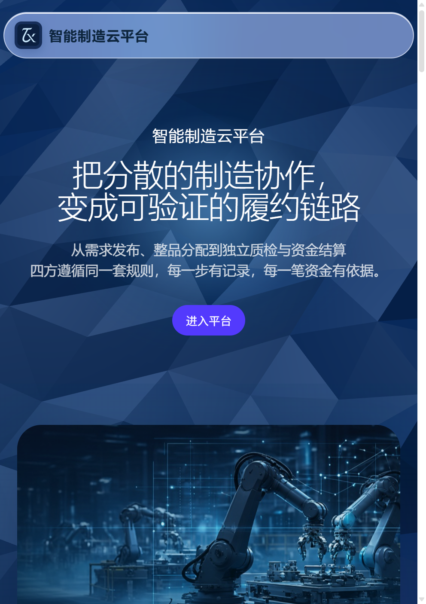
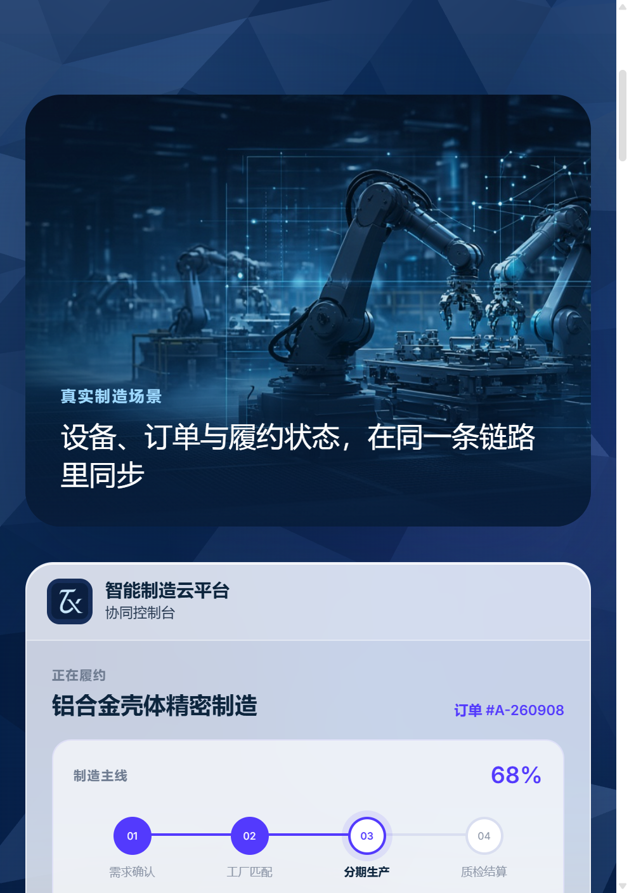
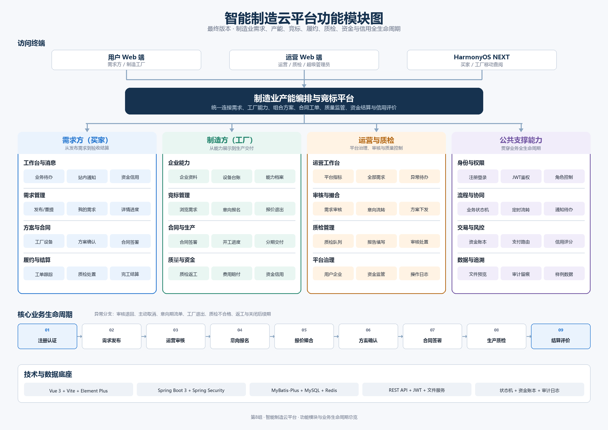

# 智能制造云平台（znzz）

简体中文 | [English](./README.md)

面向中小机加工工厂的开源**外协协作平台**。买家发布加工需求，达标工厂参与竞标，平台以服务端状态机与到期自动流转驱动全流程：报价、合同、分期生产、独立质检、资金托管结算与信用评分。



## 为什么做这个

宁波、台州、嘉兴、东莞等机加工集群里，大量中小厂仍靠电话、微信群和纸质合同接单：一家产能闲置、另一家超接；买家无法核实设备、良率与交期记录；分期付款纠纷频发。本项目把这些行业规则（意向金、思考期、分期验收、质检门槛、违约扣罚比例）写成**显式、可审计的状态流转**，让小团队也能低人力运营一个撮合市场。

项目起源于 2026 年东软 40 天产业实训，现作为 B2B 制造撮合平台的开源参考实现持续维护。

## 功能一览

| 模块 | 已实现内容 |
|------|-----------|
| **四种角色** | 买家、工厂、运营、质检（另有超级管理员）。各角色独立 Web 控制台 + HarmonyOS 移动端。 |
| **需求发布** | 工序拆解、质量门槛（AQL、公差、认证、最低良率/信用分）、意向期、附件。 |
| **两阶段竞标** | 意向期（固定小额意向金）→ 保证金期（锁定报价 + 5% 保证金）。买卖双方各有 24h 思考期。 |
| **产能匹配** | 工厂按工序报 `[min_qty, max_qty]` 区间，平台跨厂拆量并展示工序覆盖度。 |
| **方案生成** | 按价格/交期/信用生成 2～3 套组合方案。默认规则引擎；配置密钥后启用 LLM 生成（兼容 DeepSeek 接口），失败自动回退。 |
| **合同与履约** | 按厂签约、签约时限、分期生产计划、进度上报、延期处理。 |
| **质检** | 独立质检角色、质检费、合格率历史计入信用分。 |
| **资金托管与结算** | 意向金、买卖双方保证金、佣金、扣罚比例均在 `application.yml` 可配；支付宝沙箱适配器（默认关闭）。 |
| **信用体系** | 调研、完成率、合格率加权评分；按企业记录信用事件。 |
| **运营控制台** | 工单、需求/订单监管、手动关单与重新流转、所有状态变更的操作日志。 |
| **自动化** | 定时任务按到期时间推进需求/订单并推送站内通知。 |



## 架构

```
client-web (Vue 3)   admin-web (Vue 3)   harmonyos-client (ArkTS)
        \                 |                    /
          +------ backend (Spring Boot 3.3, Java 21) ------+
          |  controller -> service -> domain（状态机、报价、  |
          |  覆盖度、资金、信用、质检、通知）                 |
          +-----------------+-------------------------------+
                            |
                   MySQL 8  +  Redis 7
```



- **backend/** — Spring Boot 3.3.5、Spring Security + JWT、MyBatis-Plus、到期调度引擎、`SchemaPatcher` 幂等升级表结构、演示数据 Seeder。
- **client-web/** — Vue 3 + Vite + Element Plus，买家与工厂工作台。
- **admin-web/** — Vue 3 + Vite + Element Plus，运营/质检/超管控制台。
- **harmonyos-client/** — ArkTS 应用（DevEco Studio），覆盖买家与工厂核心流程。
- **db/** — `schema.sql` 及增量 `alter_v*.sql`；`reset_demo_data.sql` 一键重置演示数据。
- **docs/** — 设计文档、端到端流程规约、数据库设计、课程交付物。

## 快速开始

前置：JDK 21、Maven 3.9+、Node 18+、Docker（跑 MySQL/Redis）或本地实例。

```bash
# 1. 基础设施
docker compose up -d            # MySQL 8 → 3306（库 dsh_platform），Redis → 6381

# 2. 后端
cd backend
cp src/main/resources/application-local.yml.example src/main/resources/application-local.yml
#    修改数据库密码 / JWT 密钥；dsh.ai.api-key 留空则使用规则方案生成器
mvn -DskipTests spring-boot:run          # http://localhost:8080

# 3. 前端
cd ../client-web && npm install && npm run dev   # http://localhost:5173（买家 / 工厂）
cd ../admin-web  && npm install && npm run dev   # http://localhost:5174（运营 / 质检）
```

首次启动由 Seeder 创建演示账号（管理端 `admin / admin123`，买家与工厂样例见登录页）。请勿在本地演示以外复用这些凭据。

### 配置

业务参数集中在 `backend/src/main/resources/application.yml` 的 `dsh.*`：费率与比例（`dsh.fee`）、信用权重（`dsh.credit`）、各时限小时数（`dsh.time`）、AI 供应商（`dsh.ai`）、支付适配（`dsh.pay`）。密钥放在被 git 忽略的 `application-local.yml` 或环境变量（`DSH_AI_API_KEY`、`DSH_ALIPAY_APP_ID` 等）。

## 现状与路线图

注册 → 发单 → 竞标 → 签约 → 生产 → 质检 → 结算 → 信用的端到端流程已跑通，并有 `docs/deliverables` 中的手工测试用例覆盖。进行中：

- [ ] 需求/订单状态机与资金台账的自动化测试（目前为手工）
- [ ] 通知由轮询改为 WebSocket/SSE
- [ ] 在现有 `pay` 领域下支持可插拔支付渠道（微信支付、银行托管）
- [ ] 多租户加固：租户维度查询已就位，行级策略尚未实现
- [ ] Web 端国际化（目前仅中文）
- [ ] 接入工厂设备遥测（MQTT），用真实产能替代自报数字

欢迎提 Issue 与 PR，见 [CONTRIBUTING.md](./CONTRIBUTING.md)。

## 团队

杜青桐（组长；需求发布、竞标与方案撮合）、李紫璇（HarmonyOS 客户端）、鲍康琦与肖振豪（合同履约与质检、资金、信用、运营控制台）。

## 许可证

[MIT](./LICENSE)
