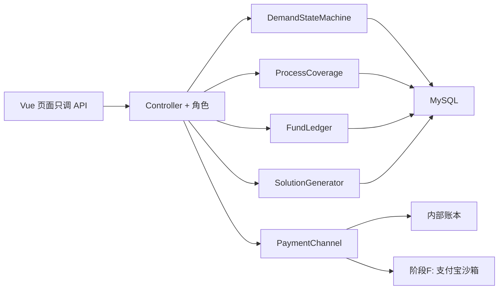
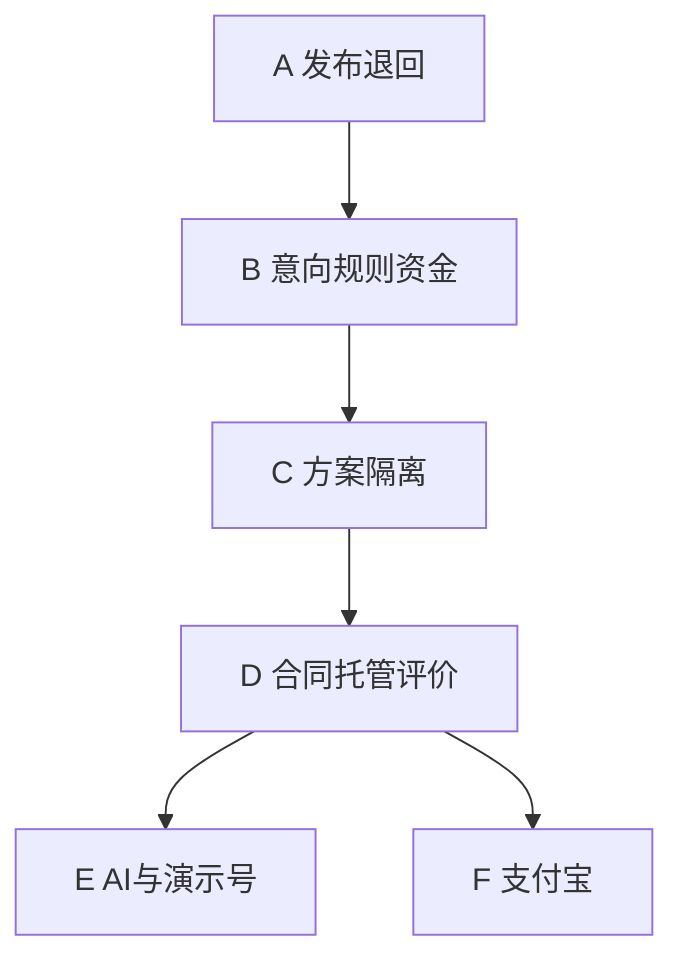

# 第一版重做计划（现行）

> 版本：v1  
> 存放：`计划/第一版重做计划.md`  
> 后续开发、改需求、排期**都以本文为准**。有变更先改本文再改代码。  
> 每阶段结束按「做完了 / 怎么测的 / 没做完 / 要你决策」四段汇报，不擅自跨阶段。

---

## 协作约定

每个阶段只做该阶段的事，测完再开下一阶段。汇报固定四段：

- **做完了什么**（页面/接口/表，各一句）
- **怎么测过的**（账号、步骤、结果）
- **没做完 / 做不了的**（卡环境、卡产品）
- **需要你决策的问题**（选项 + 建议；你不回则用文末默认值）

不把「先做着」的半成品堆到下一阶段。质量不行（复制粘贴资金逻辑、Controller 里写状态机）不算收口。

---

## 代码质量与封装（全程遵守）

现状问题：`BiddingService` / `FlowService` / `OrderService` 各写一套 `fundFlow()`，状态是散落字符串，方案生成和支付会继续膨胀。本轮按边界拆，禁止再往旧 Service 里堆方法。

**后端包结构（新增，旧类只变薄）**

- `domain.status`：`DemandStatus` 枚举 + `DemandStateMachine`（合法迁移表，非法抛业务错）。所有改 `demand.status` 只走这里。
- `domain.coverage`：`ProcessCoverageService`。输入：需求工序 + 该工序有效报名的 `max_qty`。输出：每工序 `need / covered / satisfied`。意向报名、末日提醒、思考期取消判定、方案过滤共用这一份，禁止各写各的 sum。
- `domain.fund`：`FundLedger`（唯一写 `fund_flow` 和余额的入口）。方法按业务语义：`freezeIntention` / `unfreezeIntention` / `forfeitIntention` / `freezeDeposit` / `escrowStage` / `settleToFactory` / `takeCommission`。幂等键必须是业务键（如 `INTENTION-UNFREEZE-{quotationId}`），禁止 `UUID`。Controller 和页面不直接插流水。
- `domain.deadline`：`DeadlineScheduler`（`@Scheduled`）。只负责「到期调用状态机」，不写业务细则。运营手点走同一套 `FlowService.endXxx`，保证手点和定时结果一致。
- `domain.solution`：接口 `SolutionGenerator`。阶段 C 实现 `RuleSolutionGenerator`；阶段 E 再加 `AiSolutionGenerator`，由配置切换，上层只吃统一的 `List<SolutionCombo>`。
- `domain.pay`：接口 `PaymentChannel`。阶段 D 实现 `LedgerChannel`（内部记账）；阶段 F 加 `AlipaySandboxChannel`。质检合格后只调 `channel.escrowStage(...)`，支付宝细节不进 `OrderService`。
- `domain.query`：`OrderQueryService`。按角色过滤订单/工单，列表接口不再 `select all`。

**前端封装**

- 继续用 `client-web/src/utils/labels.js` 做状态/资金文案，运营端对齐同一套词，禁止三个页面各写一份 map。
- 新增 `api/demand.js`、`api/bidding.js` 等按资源分文件，页面不直接拼 URL 长串（可逐步抽，本轮新接口必须走封装）。
- 需求详情、满足度条、倒计时做成小组件，买家/运营复用。

**硬约束**

- 业务校验在 Service，Controller 只鉴权+入参。
- 一个类只做一件事；超过「编排 + 调领域服务」就再拆。
- 新表/新字段先改 `db/schema.sql` 和 `db/alter_*.sql`，再改实体。
- 密钥只进 `application-local.yml`（不提交），代码只读配置。

---

## 总技术路线

数据上新增（可分阶段 ALTER，不一次炸库）：

- `demand`：`intention_end_at`、`thinking_end_at`、`review_end_at`、`return_reason`、`cancel_reason`
- `enterprise` 或统计视图：买家取消次数（可用查询，不必先加列）
- `fund_flow` 继续用；补「可用余额」可用流水轧差，阶段 D 若难查再加 `account` 表
- `contract`：阅读勾选、签名图、平台审状态、完工合约类型
- `inspection`：结构化报告 JSON（抽检数、不合格数、关键尺寸、是否满足）
- `survey` 新表：阶段问卷
- 配置：`dsh.fee.intention-fixed=1000`

意向期满足度：**按工序**。精加工工序只统计报名该 `processNo` 的工厂 `max_qty` 之和，与该工序 `quantity` 比。与产品名/工艺标签不一致时，以报名时选的工序为准（工厂必须选对工序）。

---

## 业务口径（1–13，已确认）

1. 每次发布都先「申请发布」（`PENDING_AUDIT`），运营通过后才进意向期；支持 `.md`/图纸。退回改完再交仍须再审。
2. **退回** = 运营打回修改（必填原因）。买家改完再交 → **待审核**，运营通过后工厂才能再看到。已发布的需求**不能改字段**；买家要改内容只能取消后发新单，平台记录取消原因和来源需求号。
3. 意向期：买家可取消（必填理由，累计次数展示）；运营可手点；按天倒计时；末日/每新增一家按工序算满足度；意向金 1000 且真退。
4. 思考期：12h；①② 可退；③ 进审核；超时默认继续。
5. 审核期：6h；通过全退；不通过扣 50% 赔工厂；超时默认不通过。
6. 保证金期才锁定报价；工厂取消扣保证金。
7. 先规则出 A/B/C，再 AI 推荐；支付走沙箱放阶段 F。
8. 方案可看工厂信息；换厂按分值降序，不能改价。
9. **一厂一份合同**。正文由买家自拟自传，平台不拟条款、不写抽样/责任模板。买家按中标厂各传文件；该厂与买家阅读+手写签；运营只确认「这份已双签」才允许**该厂**开工。方案里已按厂拆开工序和锁定价，不把整链合成一笔总报价给工厂。
10. 工厂只看自己的工单。
11. 分阶段质检；合格本阶段工钱托管平台；全部完成后完工合约再结算，佣金从保证金扣。
12. 资金先内部账本，后接支付宝沙箱。
13. 每阶段问卷，完工多维评分。

---

## 阶段 A · 先审后发 + 退回须再审 + 已发布只能取消重发

**目标**：每次发布先申请发布；运营通过后工厂才能报名；退回改完必须再审；已发布不能改字段，只能取消后发新单并留记录。

**改哪些**

- `DemandService.publish`：成功 → `PENDING_AUDIT`；可带 `sourceDemandId`（来自已取消单）。必须多工序、图纸和完整技术字段。
- `republish`（仅 `RETURNED`）→ `PENDING_AUDIT`，工厂不可见；运营 `audit PASS` 才 `PUBLISHED` 并重写 `intention_end_at`。
- `returnToBuyer`：待审核/意向期可退回；已报名作废并解冻。
- `cancelPublished`：买家对已发布单填原因取消 → `CANCELLED`，解冻；页面引导发新单。
- 字段：`return_reason`、`cancel_reason`、`source_demand_id`、`intention_end_at`。
- 买家：`RETURNED` 才能「退回修改」；`PUBLISHED` 只有「取消并重新发布」。
- 运营：详情 + 待审核通过/退回。

**测试**

- 首次发（含图纸/.md）→ 申请发布，工厂看不到；运营通过后进意向期。
- 运营退回（必填原因）→ 买家见原文；工厂列表消失。
- 买家改完再交 → **待审核**，工厂仍看不到；运营通过后工厂才能再看到。
- 已发布点修改应不可用；取消填原因后发新单，新单带上来源需求号，旧单留在列表为已取消。
- 旧「审核通过」对已发布不 500。

---

## 阶段 B · 意向期规则（1000、按工序、倒计时、真退）

**目标**：报名/取消的钱和产能算法与文档一致。

**改哪些**

- 抽出 `FundLedger`，替换三处手写 insert；`intention-fixed` 改为 1000。
- 抽出 `ProcessCoverageService`；`POST /bidding/intention` 成功后重算并通知（覆盖度变化）。
- `GET /demand/{id}/coverage` 给买家/工厂/运营共用。
- 买家 `POST /flow/{id}/cancel-intention`（必填理由）；写取消次数；退该需求下所有意向金。
- `DeadlineScheduler`：每天/每分钟扫 `intention_end_at`，到期调与运营「结束意向期」同一方法。
- 末日：覆盖未满的工序给买家发站内信（不算方案、不含价格）。
- 发布页/详情展示「近 90 天取消 N 次」，N≥3 警示。
- 前端：倒计时（剩余天）、各工序进度条「已覆盖 x / 需要 y」。

**测试**

- 报名冻 1000；买家取消（写理由）→ 流水 `UNFREEZE` 1000，报名作废。
- 工序 A 要 1000 万精加工，工厂只报工序 B 粗加工 1000 万 → 工序 A 仍显示未满足。
- 再来一家报工序 A 的 600 万 → 覆盖度即时变成 600/1000 万。
- 改库把截止日调到过去，等定时（或调手点）→ 进入思考期；末日有不足提醒。
- 同一工厂同一工序不能重复报名（已有逻辑保持）。

**已确认**：截止 = 发布时间 + 整 24h×N（如 23 号 8:00 发、5 天 → 28 号 8:00）。提醒 = 截止前整 24 小时（27 号 8:00），且仅当按工序凑不齐时发信。

---

## 阶段 C · 思考/审核/锁定 + 方案能出 + 租户隔离

**目标**：后半段不再 500；工厂看不见别人的单。

**改哪些**

- `FlowService`：思考期取消必填理由；①② 用 `ProcessCoverage` + 档案良率/信用；③ → `REVIEWING`。超时默认继续。审核通过真退 1000；不通过扣 500 均分给报名厂（`FundLedger.forfeitIntention`）。超时默认不通过。
- `SolutionService` 改名为编排，真正算法进 `RuleSolutionGenerator`：权重数组与打分下标一致；按工序过滤；凑不齐返回空并让编排把需求打成 `FLOW_FAILED` + 退款。`endLocking` **禁止**先改 `SOLUTION_GENERATED`；改为调用 `generate`，成功才改状态。
- `OrderQueryService`：买家按 `demand.tenant_id`，工厂按 `work_stage.tenant_id`。签约 `@PreAuthorize("hasRole('BUYER')")`。
- 锁定报价：工期不超过硬交期；工厂保证金期取消走扣保证金。

**测试**

- 造一笔无锁定报价的需求点生成 → 流拍 + 退意向/保证金，不 500。
- 每工序至少一家锁定后再生成 → 出 A/B/C，买家才能「看方案」。
- 结束保证金期后立刻看方案，不应出现空表（失败应是流拍）。
- 工厂账号打开工单：只有自己的行。
- 工厂调签约接口 → 403。
- 思考期：产足够仍取消 → 进审核；运营驳回 → 买家被扣 500，工厂有对应入账流水。

**已确认**：规则方案继续 A/B/C 三个（各偏一个方向）。AI 不做成「第 4 个单方向推荐」。

---

## 阶段 D · 换厂、合同双签、分阶段托管、问卷

**目标**：按口径 8–13 把履约和钱走完（内部账本）。

**改哪些**

- 方案页：工厂名/信用/认证/产能；`GET /solution/{id}/alternatives?processNo=` 按规则分降序。换厂只改厂，不改价，写 `edited_fields_json`。
- 合同：`contract.tenant_id` = 中标厂，一厂一行。买家自传附件；平台只做上传/已阅读/手写签/审过闸门。运营审过该厂合同才拆**该厂**工单并允许该厂交付。
- 工单拆分：按方案里该厂的工序；金额用该厂该工序锁定价。仅当该厂自己报了工期曲线时，才把**该工序价**按段均分（曲线有金额则用曲线）。禁止拿整链总价再切给各厂。
- 质检：结构化报告表单（抽检数、不合格数、关键尺寸结论、是否满足需求）。合格 → `PaymentChannel.escrowStage`（钱进平台，不直接给工厂）。不合格不收款。
- 全阶段 PASS → 买家签完工确认 → `settleToFactory` + `takeCommission`（从该厂保证金扣）。
- `survey` 表 + 阶段结束后推 4 题；完工汇总写入 `credit_event` 和信用分。封装 `CreditScoring`（问卷均分、完工率、合格率权重可配）。

**测试**

- 换厂：只出现同工序已锁定且量够的厂，分数降序；换完价格仍是原厂报价不可编。
- 未双签、平台未审：工厂交付按钮不可用。
- 第 1 阶段合格：买家付本阶段工钱后流水是托管，工厂余额不增加。
- 第 1 阶段不合格：无托管进账。
- 四段合格 + 完工确认：工厂到账 = 各段工钱之和 − 佣金；保证金减少佣金额。
- 每段结束后双方能提交问卷；完工后信用分变化。

**汇报后若要你决策**：阶段工钱金额从哪来——锁定总价按段均分，还是工厂报工期曲线时带每段金额？（建议：先按段均分总价，曲线有金额则用曲线。）

---

## 阶段 E · AI 出方案 + 演示账号

**目标**：同一需求既能看规则 A/B/C，也能看 AI 给的 2～3 套**综合方案**。

**改哪些**

- `AiSolutionGenerator`：一次出 **2～3** 套（`type=AI1/AI2/AI3`）。每套都要同时权衡成本、工期、质量，综合性强，不做成「只便宜 / 只快 / 只高质量」三条偏科方案（那是规则 A/B/C 的事）。
- Prompt 带需求文本、工序、质量门槛、各厂 `capability_json`、锁定报价；解析为 `SolutionCombo`；校验必须落在已锁定报价集合内（AI 不能发明价格或未报名的厂）。失败回退规则方案。
- **运营先收**：AI 方案先落 `PENDING_REVIEW`，买家不可见。运营点详情审阅，可换厂（价不变）；没问题则「下发给买家」变为 `ACTIVE` 并通知买家。
- 配置 `dsh.ai.provider` / `api-key` / `model`，只读环境变量。
- 数据脚本：1 买家 + 4 工厂（精加工/粗加工/热处理错开产能和认证）。

**测试**

- 无 key：接口明确报「未配置」，规则方案仍可用。
- 有 key：返回的厂和价格都能在锁定报价里对上。
- 演示账号能走完 A–D 主路径。

**已确认**：DeepSeek，`model=deepseek-v4-pro`。密钥只进 `application-local.yml` / 环境变量 `DSH_AI_API_KEY`，不进仓库。

---

## 阶段 F · 支付宝沙箱 + 内网穿透

**目标**：阶段款走沙箱，回调进同一套 `FundLedger`。

**改哪些**

- `PaymentChannel.startEscrow`：沙箱下单返回支付链接并标 `PENDING_PAY`；关开关走 `LedgerChannel` 立刻 `HELD`。
- 工厂意向金同样走沙箱：`out_trade_no=INTENTION-{quotationId}`，未付不算覆盖度；回调后才 `FundLedger.freezeIntention`。
- `/api/pay/alipay/notify`（免登录、纯文本 `success`）验签后按单号分流入账（幂等）。
- 密钥只在 `application-local.yml`。`notify_url` 必须是 NATAPP 公网地址。
- 前端「支付本阶段工钱」有 `payUrl` 则打开沙箱页；`PENDING_PAY` 可再点继续支付。

**测试**

- 沙箱付成功 → 本系统 `ESCROW_IN` 一笔，金额一致，重复通知不重复入账。
- 关沙箱开关：内部确认仍可用。

**已确认**：支付宝沙箱 AppId `9021000167607110`，网关 `openapi-sandbox.dl.alipaydev.com`，公钥模式；穿透用 NATAPP（本地 8080 / Web）。密钥只进 `application-local.yml`。`notify_url` 待 NATAPP 分配域名后填 `https://{域名}/api/pay/alipay/notify`，并在沙箱「应用网关」写同一地址。

---

## 阶段顺序与依赖

A→B→C→D 必须串行。E 与 F 都依赖 D 的账本/方案接口，可先后不可并行抢同一支付方法。

---

## 文末默认值（你不另说就按此做）

- 退回需求：已报名意向金立刻退、报名作废。
- 意向截止：发布时间 + 整 24h×N；凑不齐时在截止前 24 小时发信。
- 经常取消：近 90 天 ≥ 3 次警示。
- 思考超时：自动继续。审核超时：不通过（扣 500）。
- 规则方案：A/B/C 三个（各偏一个方向）。AI 出 2～3 套综合方案（`AI1/AI2/AI3`），同时权衡成本/工期/质量。
- 阶段金额：用方案里该厂该工序的锁定价；该厂再分段时均分该工序价，曲线有金额则用曲线。
- 合同：一厂一份，正文买家自备，平台不拟条款。
- 电子签：已阅读 + 手写板，不上 CA。
- E：DeepSeek `deepseek-v4-pro`；密钥本机配置。
- F：支付宝沙箱 + NATAPP；开关关则内部托管；`notify_url` 未填则报未配置，不假装已付。
- 发布：每次先申请发布，运营审过才进意向期。
